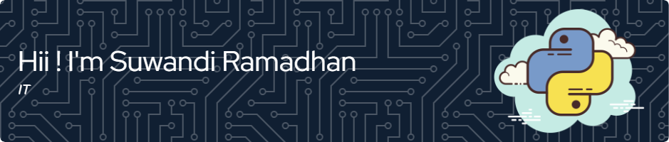

## Learning By Doing 🔥

- 💼 I’m currently working as **IT Implementator**
- 🐍 I’m currently learning **Python Programming for AI** more geared towards NLP

#### Skills Programing

 

#### The Skill That I'm Currently Learning

 

#### Skills Creative

 

#### Connect With Me

  
  
  

#### My Github Stats

